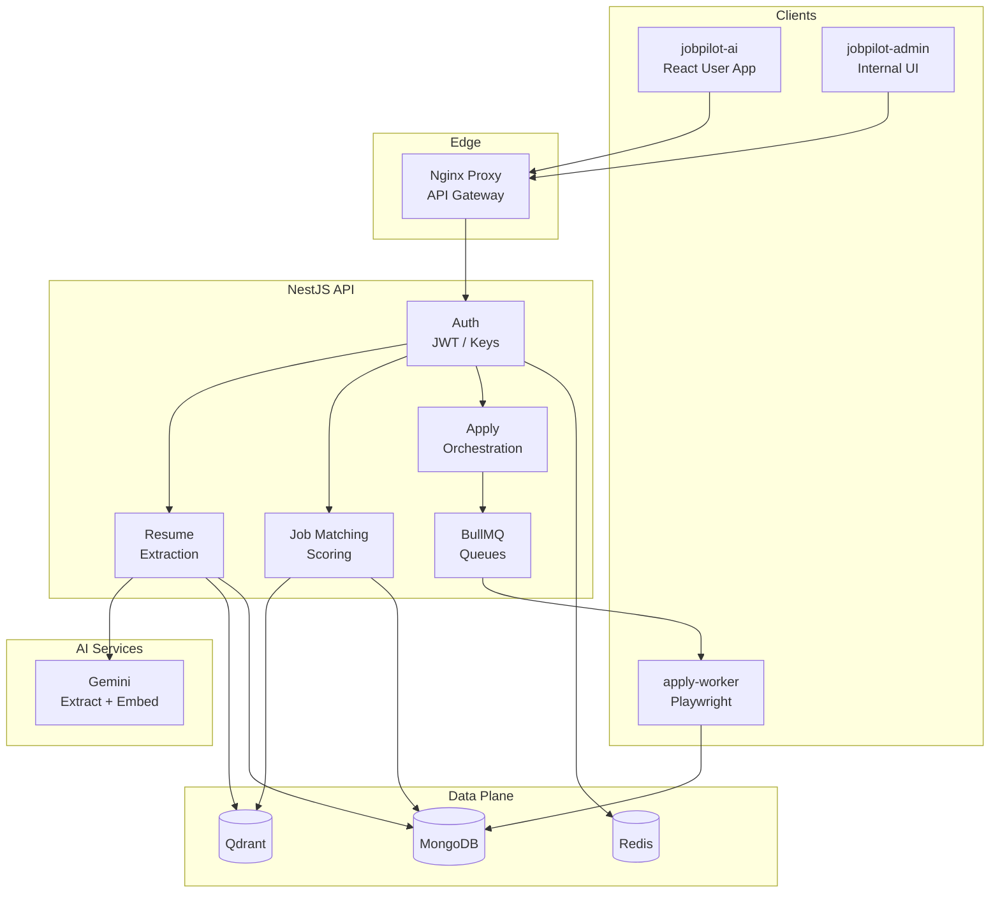
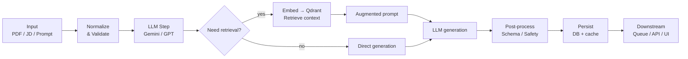
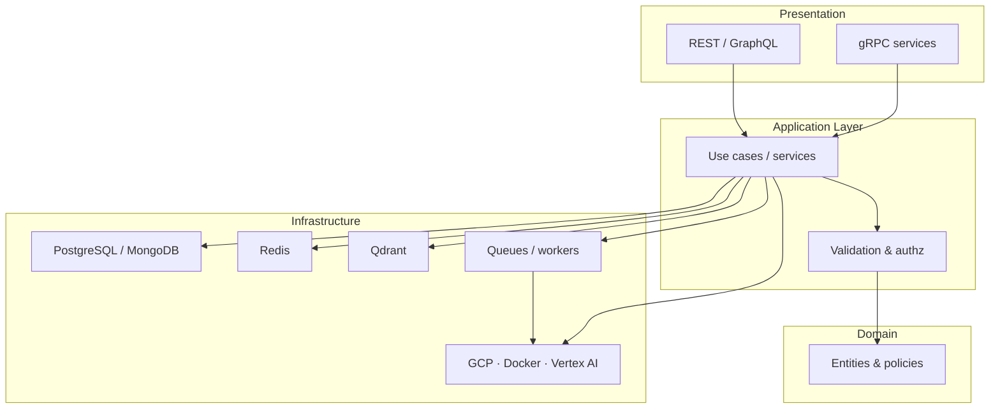
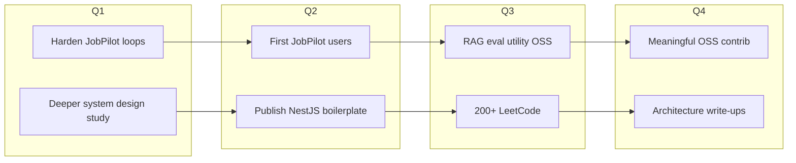
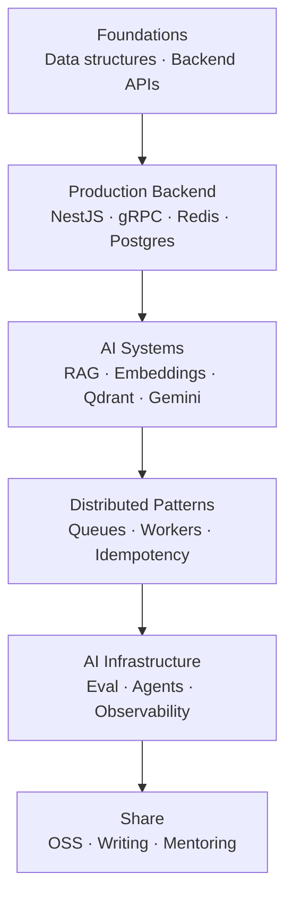

<!--
  ═══════════════════════════════════════════════════════════════
  GitHub Profile — chaitanya07422
  Terminal Dashboard Redesign
  Backend Engineer · AI Systems · Distributed Systems · Cloud
  ═══════════════════════════════════════════════════════════════
-->

<div align="center">

<!-- ── Animated Typing Banner ─────────────────────────────────── -->

[](https://git.io/typing-svg)

<!-- ── ASCII Header ───────────────────────────────────────────── -->

```text
   ██████╗██╗  ██╗ █████╗ ██╗████████╗ █████╗ ███╗   ██╗██╗   ██╗ █████╗
  ██╔════╝██║  ██║██╔══██╗██║╚══██╔══╝██╔══██╗████╗  ██║╚██╗ ██╔╝██╔══██╗
  ██║     ███████║███████║██║   ██║   ███████║██╔██╗ ██║ ╚████╔╝ ███████║
  ██║     ██╔══██║██╔══██║██║   ██║   ██╔══██║██║╚██╗██║  ╚██╔╝  ██╔══██║
  ╚██████╗██║  ██║██║  ██║██║   ██║   ██║  ██║██║ ╚████║   ██║   ██║  ██║
   ╚═════╝╚═╝  ╚═╝╚═╝  ╚═╝╚═╝   ╚═╝   ╚═╝  ╚═╝╚═╝  ╚═══╝   ╚═╝   ╚═╝  ╚═╝

        ▸ Backend Engineer · AI Systems · Distributed Systems · Cloud ◂
                           pocketrocketlabs.com
```
<!-- ── Identity Badges ────────────────────────────────────────── -->

[](https://www.linkedin.com/in/chaitanya-kadavakollu/)
[](https://chaitanya-portfolio-2es6.vercel.app/)
[](mailto:kadavkolluchaitanya@gmail.com)
[](https://github.com/chaitanya07422)

<br/>


</div>

---

<!-- ═══════════════════════════════════════════════════════════════
     $ neofetch
     ═══════════════════════════════════════════════════════════════ -->

```bash
$ neofetch
```

<div align="center">

```text
          .-/+oossssoo+/-.               chaitanya@github
       `:+ssssssssssssssssss+:`          ─────────────────────────────
     -+ssssssssssssssssssyyssss+-        OS:       Engineer / Linux soul
   .ossssssssssssssssssdMMMNysssso.      Host:     PocketRocket Labs
  /ssssssssssshdmmNNmmyNMMMMhssssss/     Kernel:   Backend + AI Systems
 +ssssssssshmydMMMMMMMNddddyssssssss+    Uptime:   Shipping production AI
/sssssssshNMMMyhhyyyyhmNMMMNhssssssss/   Packages: NestJS · Fastify · gRPC
.ssssssssdMMMNhsssssssssshNMMMdssssssss. Shell:    TypeScript · Java · Python
+sssshhhyNMMNyssssssssssssyNMMMysssssss+ Resolution: System Design focused
ossyNMMMNyMMhsssssssssssssshmmmhssssssso Theme:    Terminal green on black
ossyNMMMNyMMhsssssssssssssshmmmhssssssso Icons:    Docker · GCP · Qdrant
+sssshhhyNMMNyssssssssssssyNMMMysssssss+ Terminal: VS Code · IntelliJ
.ssssssssdMMMNhsssssssssshNMMMdssssssss. CPU:      LLMs · RAG · Agents
 /sssssssshNMMMyhhyyyyhdNMMMNhssssssss/  GPU:      Vertex AI · Gemini
  +sssssssssdmydMMMMMMMMddddyssssssss+   Memory:   PostgreSQL · Mongo · Redis
   .osssssssssssssdmmNNmmyNMMMMhssssso.  Status:   ● online — building
     -+sssssssssssssssssyyyssss+-
       `:+ssssssssssssssssss+:`          ████ ████ ████ ████ ████ ████
          .-/+oossssoo+/-.
```

</div>

---

<!-- ═══════════════════════════════════════════════════════════════
     $ whoami
     ═══════════════════════════════════════════════════════════════ -->

```bash
$ whoami
```

```text
┌─────────────────────────────────────────────────────────────────────────┐
│  name      →  Chaitanya Kadavakollu                                     │
│  role      →  Software Developer @ PocketRocket Labs                    │
│  focus     →  Backend Engineering · AI Systems · Distributed Systems    │
│  stack     →  NestJS · TypeScript · Python · GCP · Vertex AI · Qdrant   │
│  location  →  India · Remote-friendly                                   │
│  mission   →  Build AI systems that are fast, reliable, and useful     │
└─────────────────────────────────────────────────────────────────────────┘
```

---

<!-- ═══════════════════════════════════════════════════════════════
     $ cat about.md
     ═══════════════════════════════════════════════════════════════ -->

```bash
$ cat ~/about.md
```

<details open>
<summary><b>▸ about.md</b> — expand / collapse</summary>

<br/>

Backend engineer building AI-powered products where LLMs, distributed systems, and cloud infrastructure meet.

I optimize for software that is **fast**, **reliable**, and **useful** — not merely clever.

**Software Developer at [PocketRocket Labs](https://pocketrocketlabs.com/)** — AI-driven education for children. Day to day: NestJS/gRPC APIs, Qdrant vector search, Vertex AI workflows, GCP deploy pipelines.

Side systems: **JobPilot AI** (resume → match → apply with LLMs + RAG) and **AI Video Studio** (research → script → publish).

```diff
+ Own the full problem path — API to infra
+ Prefer production constraints over demo magic
- AI for AI's sake
- Architecture theater
```
</details>

---

<!-- ═══════════════════════════════════════════════════════════════
     $ cat highlights.log
     ═══════════════════════════════════════════════════════════════ -->

```bash
$ cat ~/highlights.log | tail -n 20
```

```text
[OK]  Software Developer @ PocketRocket Labs
[OK]  Shipping production AI systems (education platform)
[OK]  Team Lead — NASA Space Apps Challenge
[OK]  130+ LeetCode problems solved (mostly Java)
[OK]  Building JobPilot AI — resume → match → apply pipeline
[OK]  Building AI Video Studio — research → script → publish
[OK]  NestJS · gRPC · RAG · Qdrant · Vertex AI · GCP in daily use
```

| Signal | Detail |
|:-------|:-------|
| **Current Role** | Software Developer — PocketRocket Labs |
| **Domain** | Backend · AI Systems · Cloud Infrastructure |
| **Production AI** | Vertex AI · Gemini · RAG · Qdrant |
| **Leadership** | Team Lead — NASA Space Apps Challenge |
| **Practice** | 130+ LeetCode · system design study |

---

<!-- ═══════════════════════════════════════════════════════════════
     $ ps aux | grep focus
     ═══════════════════════════════════════════════════════════════ -->

```bash
$ ps aux | grep --color=auto "focus\|status"
```

### Current Focus

```text
 USER       PID  %CPU  %MEM  COMMAND
 chaitanya  1001  ███   --   [building] Production backend APIs @ PocketRocket Labs
 chaitanya  1002  ███   --   [building] JobPilot AI — job automation SaaS
 chaitanya  1003  ██    --   [building] AI Video Studio — content pipeline
 chaitanya  1004  ██    --   [learning] Distributed systems & system design
 chaitanya  1005  ██    --   [learning] Production RAG & agentic workflows
 chaitanya  1006  █     --   [learning] AI infrastructure patterns
```

### Current Status

<div align="center">

| Component | State | Notes |
|:----------|:-----:|:------|
| PocketRocket Labs | `● RUNNING` | Production AI education backend |
| JobPilot AI | `● ACTIVE` | Core loops implemented; iterating toward first users |
| AI Video Studio | `● ACTIVE` | Local + Docker pipeline in progress |
| Backend Boilerplate | `○ PLANNED` | NestJS starter → open-source kit |
| Open Source | `○ RAMPING` | 2026 contribution goals set |
| Blog / Writing | `○ QUEUED` | Architecture deep-dives planned |

</div>

```bash
$ uptime
  load average: backend high · ai systems high · distraction low
  status: available for interesting backend / AI infrastructure conversations
```

---

<!-- ═══════════════════════════════════════════════════════════════
     $ ls projects/
     ═══════════════════════════════════════════════════════════════ -->

```bash
$ ls -la ~/projects/
```

```text
drwxr-xr-x  jobpilot-ai/           # Large AI SaaS — job application automation
drwxr-xr-x  ai-video-studio/       # Backend AI automation — research → publish
drwxr-xr-x  backend-boilerplate/   # Production-ready NestJS starter
drwxr-xr-x  imdb-sentiment/        # NLP sentiment analysis
drwxr-xr-x  resume-screening-nlp/  # Resume ranking & matching
drwxr-xr-x  nasa-space-apps/       # Landsat comparison tool (Team Lead)
```

```bash
$ cat ~/projects/*/CARD.md
```

<!-- ── Project Cards ──────────────────────────────────────────── -->

<table>
<tr>
<td width="50%" valign="top">

#### 🟩 JobPilot AI
`status: in progress` · `type: AI SaaS`

**Description**  
AI-powered platform for end-to-end job application workflows: resume optimization, cover letter & email generation, interview preparation, and application automation.

**What it does**
- Resume → profile → vector embeddings (Gemini + Qdrant)
- Job ingest → embedding → cosine match scoring
- Accept → BullMQ queue → Playwright apply worker
- User app + admin UI + NestJS API

**Tech Stack**  


**Current Status**  
Core product loops live in the NestJS backend; iterating on reliability, matching quality, and user experience.

**Future Vision**  
Ship to production users, harden the apply worker, and deepen personalization in matching + interview prep.

<br/>

🔗 [Backend](https://github.com/chaitanya07422/jobpilot-backend) · [App](https://github.com/chaitanya07422/jobpilot-ai) · [Admin](https://github.com/chaitanya07422/jobpilot-admin) · [Worker](https://github.com/chaitanya07422/jobpilot-apply-worker)

</td>
<td width="50%" valign="top">

#### 🟩 AI Video Studio
`status: in progress` · `type: AI automation`

**Description**  
Backend AI automation platform for faceless explainer / Shorts-style content: research, script generation, media pipeline, and publishing workflows.

**What it does**
- GPT-assisted script + storyboard generation
- Local image / narration / caption pipeline
- Docker stack with LAN dashboard
- Remotion + FFmpeg render path

**Tech Stack**  


**Current Status**  
CLI + Docker dashboard pipelines working; iterating on brand packs, deploy automation, and render reliability.

**Future Vision**  
A repeatable research → script → publish system that stays mostly local for media generation.

<br/>

🔗 Private repo · architecture documented internally

</td>
</tr>
<tr>
<td width="50%" valign="top">

#### 🟩 Backend Boilerplate
`status: ready / polishing` · `type: starter kit`

**Description**  
Production-minded NestJS starter with auth, caching, Docker, and Swagger — built to skip the same setup tax on every new service.

**Tech Stack**  


**Current Status**  
Usable internally; packaging as a cleaner open-source starter is on the 2026 roadmap.

**Future Vision**  
Public NestJS kit with sensible defaults for auth, caching, observability hooks, and Docker Compose.

</td>
<td width="50%" valign="top">

#### 🟩 NASA Space Apps — Landsat Tool
`status: completed` · `type: hackathon` · `role: Team Lead`

**Description**  
Web app comparing Landsat satellite imagery against ground observations, built for the NASA Space Apps Challenge.

**Tech Stack**  


**Current Status**  
Delivered as Team Lead for the challenge project.

**Future Vision**  
Keep as a leadership + rapid-build signal; revisit remote-sensing ideas when relevant.

</td>
</tr>
<tr>
<td width="50%" valign="top">

#### 🟩 IMDb Sentiment Analysis
`status: completed` · `type: NLP / ML`

**Description**  
NLP sentiment classifier for movie reviews using classical ML (logistic regression) and text-processing tooling.

**Tech Stack**  


**Current Status**  
Completed learning / portfolio project.

**Future Vision**  
Foundation for later production NLP / RAG work — not a product by itself.

</td>
<td width="50%" valign="top">

#### 🟩 Resume Screening NLP
`status: completed` · `type: NLP`

**Description**  
NLP-based system for ranking and matching resumes against job descriptions — early exploration of the problem space that JobPilot now attacks with LLMs + vectors.

**Tech Stack**  


**Current Status**  
Completed; ideas carried forward into JobPilot's matching pipeline.

**Future Vision**  
Continue evolving matching quality inside JobPilot rather than as a standalone tool.

</td>
</tr>
</table>

---

<!-- ═══════════════════════════════════════════════════════════════
     $ tree backend/ && architecture interests
     ═══════════════════════════════════════════════════════════════ -->

```bash
$ tree ~/architecture-interests/
```

```text
architecture-interests/
├── ai-systems/
│   ├── rag-pipelines/
│   ├── llm-orchestration/
│   ├── vector-search/
│   └── agentic-workflows/
├── distributed-systems/
│   ├── queues-and-workers/
│   ├── idempotency/
│   └── failure-modes/
├── backend/
│   ├── modular-monoliths/
│   ├── grpc-apis/
│   └── api-design/
└── cloud-infra/
    ├── gcp-deployments/
    ├── dockerized-services/
    └── observability-basics/
```

### Architecture Interests

Things I actively design and think about:

- **RAG in production** — chunking, embeddings, retrieval quality, evaluation loops
- **Queue-driven backends** — BullMQ workers, retries, dead-letter thinking
- **Modular NestJS services** — clear module boundaries without premature microservices
- **gRPC + REST coexistence** — when typed RPC helps internal surfaces
- **Vector search** — Qdrant collections, cosine matching, hybrid ranking instincts
- **AI automation pipelines** — research → generate → validate → publish

---

<!-- ═══════════════════════════════════════════════════════════════
     Mermaid — JobPilot Architecture
     ═══════════════════════════════════════════════════════════════ -->

```bash
$ cat ~/diagrams/jobpilot-architecture.mmd
```



---

<!-- ═══════════════════════════════════════════════════════════════
     Mermaid — AI Pipeline
     ═══════════════════════════════════════════════════════════════ -->

```bash
$ cat ~/diagrams/ai-pipeline.mmd
```



---

<!-- ═══════════════════════════════════════════════════════════════
     Mermaid — Backend Architecture
     ═══════════════════════════════════════════════════════════════ -->

```bash
$ cat ~/diagrams/backend-architecture.mmd
```



---

<!-- ═══════════════════════════════════════════════════════════════
     $ cat philosophy.txt
     ═══════════════════════════════════════════════════════════════ -->

```bash
$ cat ~/philosophy.txt
```

```text
╔══════════════════════════════════════════════════════════════════╗
║                   ENGINEERING PHILOSOPHY                         ║
╠══════════════════════════════════════════════════════════════════╣
║                                                                  ║
║  1. Ship impact, not just code.                                  ║
║     Every system should solve a problem someone actually has.    ║
║                                                                  ║
║  2. AI earns its place — it isn't the headline.                  ║
║     LLMs and RAG only when they make the product better.         ║
║                                                                  ║
║  3. Design for the scale you'll need.                            ║
║     Not the scale that sounds impressive in an interview.        ║
║                                                                  ║
║  4. Own the full path of a problem.                              ║
║     From backend architecture to the infra that ships it.        ║
║                                                                  ║
║  5. Prefer clear modules over premature microservices.           ║
║     Boundaries first. Distribution when pain is real.            ║
║                                                                  ║
╚══════════════════════════════════════════════════════════════════╝
```

---

<!-- ═══════════════════════════════════════════════════════════════
     $ docker ps  — Tech Stack Dashboard
     ═══════════════════════════════════════════════════════════════ -->

```bash
$ docker ps --format "table {{.Names}}\t{{.Image}}\t{{.Status}}"
```

### Tech Stack Dashboard

<div align="center">

| Layer | Stack |
|:------|:------|
| **Languages** |      |
| **Backend** |      |
| **Frontend** |    |
| **Database** |    |
| **AI** |     |
| **Cloud** |   |
| **Tools** |      |

</div>

<details>
<summary><b>▸ skillicons view</b></summary>

<br/>

<div align="center">


</div>

</details>

```text
$ echo "Production AI in daily use: Vertex AI · Gemini · RAG · Qdrant"
Production AI in daily use: Vertex AI · Gemini · RAG · Qdrant
```

---

<!-- ═══════════════════════════════════════════════════════════════
     $ history | grep terminal-commands
     ═══════════════════════════════════════════════════════════════ -->

```bash
$ history | grep -E "build|ship|learn" | tail -n 12
```

```bash
  501  nest g module resume && nest g service matching
  502  docker compose up -d redis qdrant
  503  curl -s localhost:6333/collections | jq .
  504  gcloud auth application-default login
  505  # vertex ai embedding job — pocketrocket
  506  redis-cli MONITOR | grep apply
  507  git commit -m "feat(apply): harden worker retries"
  508  leetcode submit 3sum.java
  509  man system-design | less
  510  cat philosophy.txt | cowsay -f tux
  511  ssh dell 'docker compose ps'   # ai video studio
  512  clear && neofetch
```

### Quick Commands (recruiter edition)

```bash
$ whoami                    # role, focus, stack
$ ls projects               # JobPilot · Video Studio · NASA · NLP
$ cat philosophy.txt        # how I decide what to build
$ docker ps                 # tech stack dashboard
$ git log --oneline         # GitHub activity below
$ cat roadmap.md            # 2026 plan
$ contact                   # LinkedIn · Email · Portfolio
```

---

<!-- ═══════════════════════════════════════════════════════════════
     Work at PocketRocket Labs (confidential-safe)
     ═══════════════════════════════════════════════════════════════ -->

```bash
$ journalctl -u pocketrocket-labs --since today
```

<details open>
<summary><b>▸ currently building @ PocketRocket Labs</b></summary>

<br/>

**AI-powered educational platform for children**

Backend systems that power AI-driven learning experiences:

- Production backend APIs (**NestJS**, **gRPC**) for AI tutor, journal, and podcast experiences
- Vector / semantic search infrastructure (**Qdrant**) for personalized content retrieval
- Adaptive learning and learning-analytics pipelines
- Deployment pipelines and cloud infrastructure on **GCP**, with **Vertex AI**–backed workflows

<sub>Implementation details stay high-level out of respect for company confidentiality.</sub>

</details>

---

<!-- ═══════════════════════════════════════════════════════════════
     $ git log — GitHub Stats
     ═══════════════════════════════════════════════════════════════ -->

```bash
$ git log --oneline --graph --decorate | head
$ gh stats --user chaitanya07422
```

### GitHub Stats

<div align="center">


<br/>


<br/>


</div>

### Contribution Graph

<div align="center">


</div>

### Snake Animation

<div align="center">


</div>

<sub>Snake regenerates daily via GitHub Actions (`output` branch). First run may take a moment after merge.</sub>

---

<!-- ═══════════════════════════════════════════════════════════════
     $ cat roadmap.md
     ═══════════════════════════════════════════════════════════════ -->

```bash
$ cat ~/roadmap.md
```

### Roadmap — 2026



| Goal | Why it matters |
|:-----|:---------------|
| Ship JobPilot AI to first real users | Close the loop from architecture → product impact |
| Deepen system design fluency | Stronger backend / distributed systems interviews |
| Cross **200+** DSA problems | Graphs + DP focus; keep Java sharp |
| Open-source NestJS boilerplate | Share a starter I would actually use |
| First meaningful OSS contribution | Learn from established AI / backend infra projects |
| Architecture deep-dives | Turn production lessons into clear writing |
---

<!-- ═══════════════════════════════════════════════════════════════
     $ cat learning.md
     ═══════════════════════════════════════════════════════════════ -->

```bash
$ cat ~/learning.md
```

### Currently Learning

```text
┌──────────────────────────────┬────────────────────────────────────┐
│ Topic                        │ Why                                │
├──────────────────────────────┼────────────────────────────────────┤
│ AI agents & agentic workflows│ Move beyond single-shot LLM calls  │
│ Production RAG               │ Retrieval quality + evaluation     │
│ Distributed systems design   │ Queues, consistency, failure modes │
│ High-throughput backends     │ Design instincts for real load     │
│ AI infrastructure patterns   │ How models meet product backends   │
└──────────────────────────────┴────────────────────────────────────┘
```

<details>
<summary><b>▸ learning roadmap diagram</b></summary>

<br/>



</details>

---

<!-- ═══════════════════════════════════════════════════════════════
     $ cat oss-goals.md
     ═══════════════════════════════════════════════════════════════ -->

```bash
$ cat ~/oss-goals-2026.md
```

### Open Source Goals

Honest status: I'm **open-source focused**, not yet a heavy public contributor. 2026 is about changing that with concrete deliverables.

```diff
+ Publish the backend boilerplate as a proper open-source starter kit
+ Open source a small RAG evaluation utility
+ Make a first meaningful contribution to an established AI / backend infra project
+ Write architecture deep-dives from production systems work
```

```text
$ git remote -v
origin  https://github.com/chaitanya07422  (push + learn in public)
```

---

<!-- ═══════════════════════════════════════════════════════════════
     $ cat blog.md
     ═══════════════════════════════════════════════════════════════ -->

```bash
$ ls ~/blog/ && cat ~/blog/README.md
```

### Blog / Writing

```text
~/blog/
├── README.md                 # this file
├── drafts/
│   ├── rag-in-production.md  # planned
│   ├── nestjs-modular.md     # planned
│   └── queue-workers.md      # planned
└── published/                # coming soon
```

I write when a production lesson is worth sharing — not for content volume.

**Planned themes**
- RAG retrieval quality and evaluation loops
- Modular NestJS boundaries that stay maintainable
- BullMQ / worker reliability patterns
- What “AI infrastructure” means for product backends

Portfolio & company context: [chaitanya-portfolio](https://chaitanya-portfolio-2es6.vercel.app/) · [pocketrocketlabs.com](https://pocketrocketlabs.com/)

---

<!-- ═══════════════════════════════════════════════════════════════
     $ contact
     ═══════════════════════════════════════════════════════════════ -->

```bash
$ contact --format human
```

### Contact

```text
┌────────────────────────────────────────────────────────────┐
│  $ mail -s "hello" kadavkolluchaitanya@gmail.com           │
│  $ open https://www.linkedin.com/in/chaitanya-kadavakollu/ │
│  $ open https://chaitanya-portfolio-2es6.vercel.app/       │
│  $ open https://github.com/chaitanya07422                  │
│  $ open https://pocketrocketlabs.com/                      │
└────────────────────────────────────────────────────────────┘
```

<div align="center">

| Channel | Link |
|:--------|:-----|
| **Email** | [kadavkolluchaitanya@gmail.com](mailto:kadavkolluchaitanya@gmail.com) |
| **LinkedIn** | [chaitanya-kadavakollu](https://www.linkedin.com/in/chaitanya-kadavakollu/) |
| **Portfolio** | [chaitanya-portfolio](https://chaitanya-portfolio-2es6.vercel.app/) |
| **GitHub** | [chaitanya07422](https://github.com/chaitanya07422) |
| **Company** | [PocketRocket Labs](https://pocketrocketlabs.com/) |

<br/>

[](https://www.linkedin.com/in/chaitanya-kadavakollu/)
[](mailto:kadavkolluchaitanya@gmail.com)
[](https://chaitanya-portfolio-2es6.vercel.app/)

</div>

---

<!-- ═══════════════════════════════════════════════════════════════
     Fun facts + footer
     ═══════════════════════════════════════════════════════════════ -->

```bash
$ fortune | cowsay
```

```text
 _______________________________________________
/ 130+ LeetCode problems — mostly Java.         \
| Team Lead on a NASA Space Apps project.       |
| Learns best by finding the right analogy      |
\ before touching the code.                     /
 -----------------------------------------------
        \   ^__^
         \  (oo)\_______
            (__)\       )\/\
                ||----w |
                ||     ||
```

---

<div align="center">

```text
═══════════════════════════════════════════════════════════════
  Chaitanya Kadavakollu
  Software Developer @ PocketRocket Labs
  Backend · AI Systems · Distributed Systems · Cloud
═══════════════════════════════════════════════════════════════

  "Ship impact, not just code."

  ★ Thanks for visiting — feel free to fork ideas, not vibes.
  ★ Open to backend / AI systems conversations.

  $ exit
  logout
  Connection to github.com closed.
```

<br/>


<sub>
  Built as a terminal dashboard · Updated for recruiters who read READMEs ·
  <a href="https://github.com/chaitanya07422">chaitanya07422</a>
</sub>

</div>
