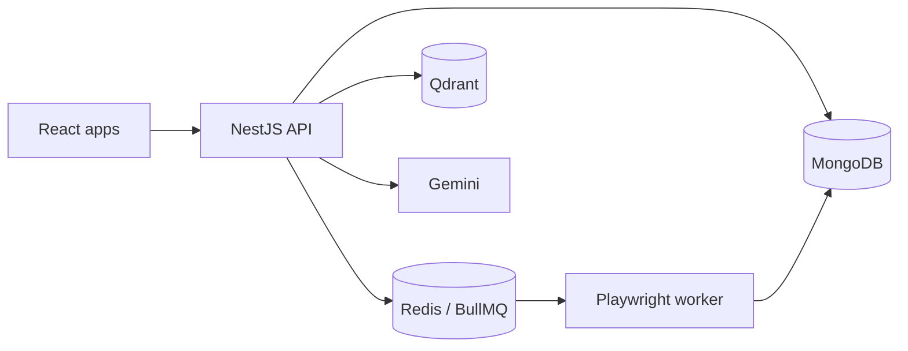

<!--
  GitHub Profile — chaitanya07422
  Backend · AI Systems · Cloud · Full-Stack
  Optimized for recruiters and engineering managers (30–60s scan)
-->

<div align="center">

[](https://git.io/typing-svg)

**Software Engineer** building production backends, AI/LLM pipelines, and cloud-deployed products.

I design systems that are **reliable, maintainable, and shippable** — APIs, RAG/vector search, workers, and deployment pipelines.

[](https://www.linkedin.com/in/chaitanya-kadavakollu/)
[](https://chaitanya-portfolio-2es6.vercel.app/)
[](mailto:kadavakolluchaitanya@gmail.com)
[](https://github.com/chaitanya07422)
[](https://pocketrocketlabs.com/)

| | |
|:--|:--|
| **Role** | Software Engineer @ [PocketRocket Labs](https://pocketrocketlabs.com/) |
| **Focus** | Backend APIs · AI / RAG · Queues & workers · Cloud deploy |
| **Open to** | Freelance / contract work in AI apps, full-stack SaaS, APIs, and cloud |
| **Location** | India · Remote-friendly |

</div>

---

## What I can deliver

| Capability | Evidence |
|:-----------|:---------|
| **Production AI backends** | NestJS services, Gemini / Vertex AI workflows, vector search with Qdrant |
| **Full product systems** | Multi-repo SaaS (API + web + admin + worker), not demo-only scripts |
| **APIs & integrations** | REST APIs, JWT / OAuth, job-board sync, Telegram OTP, object storage |
| **Async & automation** | BullMQ / Redis queues, Playwright workers, resumable media pipelines |
| **Cloud & DevOps** | Docker Compose, GCP / OCI deploy patterns, GitHub Actions → PM2 / GHCR |
| **Data layer** | MongoDB, PostgreSQL (Prisma), Redis, Qdrant |

> I can own an API, an AI feature, or a deployable product slice end-to-end — that is the work I do day to day.

---

## Professional work — PocketRocket Labs

**Software Engineer** (full-time; previously intern) at [PocketRocket Labs](https://pocketrocketlabs.com/) — a product studio building child-first learning technology.

I contribute to the **backend and AI systems** behind the company’s educational platform (implementation details stay high-level for confidentiality):

- **NestJS + gRPC** services for learning product surfaces
- **Qdrant** vector / semantic retrieval for personalized context
- **Vertex AI (Gemini)** workflows for conversational / adaptive learning experiences
- **MongoDB · Redis · BullMQ** for data, caching, and background jobs
- **GCP** deployment with Docker, PM2 / systemd, and GitHub Actions pipelines
- Privacy-minded infrastructure patterns (e.g. PII-aware processing where applicable)

This is production product engineering under real constraints — latency, cost, reliability, and child-facing safety — not a hackathon prototype.

<sub>Company site: [pocketrocketlabs.com](https://pocketrocketlabs.com/) · Portfolio deep-dive: [chaitanya-portfolio](https://chaitanya-portfolio-2es6.vercel.app/)</sub>

---

## Featured public projects

Public repos that show how I design and ship systems. Status labels match the code, not marketing.

### JobPilot AI — job application automation SaaS

**Resume → embed → match → accept → queue → browser apply**

Modular NestJS backend with a React user app, admin UI, and a Playwright apply worker. Built as a real multi-service product architecture.

| Layer | Stack |
|:------|:------|
| API | NestJS, TypeScript, JWT + Google OAuth, Swagger, Helmet, Throttler |
| Data | MongoDB, Redis, Qdrant |
| AI | Gemini (extract + embeddings), cosine job matching |
| Jobs | BullMQ `apply` queue → Playwright worker (Greenhouse-focused) |
| Infra | Docker Compose (local), OCI object storage option, GitHub Actions deploy |

**Engineering highlights**
- Clear auth planes: user JWT, admin API key, worker secret
- Producer/consumer boundary between API and apply worker
- Job ingest from boards (Greenhouse / Lever / Ashby paths in backend)
- Health checks, queue dashboard, and deploy-minded layout

**Repos**
- [jobpilot-backend](https://github.com/chaitanya07422/jobpilot-backend)
- [jobpilot-ai](https://github.com/chaitanya07422/jobpilot-ai) (user app)
- [jobpilot-admin](https://github.com/chaitanya07422/jobpilot-admin)
- [jobpilot-apply-worker](https://github.com/chaitanya07422/jobpilot-apply-worker)



---

### Local AI Video Studio — self-hosted content pipeline

**Private repo** · **Topic → GPT script → local images / TTS / captions → Remotion / FFmpeg MP4**

Faceless explainer videos (Shorts + longer Deep Dive formats). Media generation stays on your machine; GPT is used for scripts.

| Layer | Stack |
|:------|:------|
| Orchestration | FastAPI + Redis / RQ |
| Dashboard | React (Vite) + bearer token access |
| Media | SDXL, Kokoro TTS, Whisper, Remotion, FFmpeg |
| Ops | Docker Compose, GHCR image publish, CI checks |

**Engineering highlights**
- End-to-end local AI media OS with a LAN dashboard
- Resumable / staged pipeline thinking for long-running jobs
- Dockerized path for a home render server + Mac CLI workflows

🔗 [local-ai-video-studio](https://github.com/chaitanya07422/local-ai-video-studio) · **private**

---

### DataPilot — tabular data upload, clean, and embed

**Upload → parse/clean → chunk → embed → Qdrant**

Fastify API + BullMQ worker + Next.js UI. Honest WIP: core ETL/embed path is live; auth and conversational AI surfaces are still placeholders.

| Layer | Stack |
|:------|:------|
| API / Worker | Fastify, BullMQ, Prisma |
| Data | PostgreSQL, Redis, Qdrant |
| Embeddings | Local MiniLM (`@xenova/transformers`); optional OpenAI |
| UI | Next.js, AG Grid |

🔗 [Backend](https://github.com/chaitanya07422/Backend) · [Frontend](https://github.com/chaitanya07422/frontend)

---

### Other signals

| Project | What it shows |
|:--------|:--------------|
| [GATE Mentor](https://github.com/chaitanya07422/gate-mentor) | NestJS + Next.js monorepo with Claude-assisted teaching (personal study product; phased stubs documented) |
| [openai-image-gen](https://github.com/chaitanya07422/openai-image-gen) | Small, reliable Python CLI + Streamlit UI for OpenAI Images |
| [AstraOS](https://github.com/chaitanya07422/Astraos) | Documented embedded-Linux learning path on Radxa ZERO 3W (experiments + roadmap; not a shipped OS) |
| [Portfolio site](https://github.com/chaitanya07422/chaitanya-portfolio) | Personal site — [live](https://chaitanya-portfolio-2es6.vercel.app/) |

---

## Selected achievements

| Signal | Detail |
|:-------|:-------|
| **NASA Space Apps 2024** | Global Finalist — Team Lead, Landsat visualization project |
| **Patent** | Lead inventor — Indian Patent Application **202541034485 A** (AI-driven non-invasive sciatica diagnostic concept; ESP32 / IMU + ML) |
| **Production AI** | Daily NestJS / gRPC / Qdrant / Vertex AI work at PocketRocket Labs |

---

## Tech stack

Technologies I use in professional or public projects (not a wishlist).

| Area | Tools |
|:-----|:------|
| **Languages** | TypeScript, JavaScript, Python, Java, C++, SQL |
| **Backend** | NestJS, Fastify, Node.js, REST, gRPC, BullMQ |
| **Frontend** | React, Next.js, Vite, Tailwind CSS; Qt/QML (device UI experience) |
| **Data** | MongoDB, PostgreSQL / Prisma, Redis, Qdrant |
| **AI / ML** | Vertex AI, Gemini, OpenAI APIs, RAG / embeddings, Anthropic SDK, local SDXL / Whisper / TTS stacks |
| **Cloud / Ops** | GCP, OCI, Docker, Docker Compose, Nginx, PM2, systemd, GitHub Actions, GHCR |
| **Quality / API hygiene** | Swagger / OpenAPI, Helmet, rate limiting, health checks (Terminus), structured logging |

---

## How I work

```text
1. Clarify the outcome     — what “done” means
2. Design the thin slice   — API + data + AI + deploy path that ships
3. Build with boundaries   — modules, queues, and auth planes that stay maintainable
4. Instrument & harden     — failures, retries, env config, honest status docs
5. Hand over cleanly       — README, env examples, and a system someone else can run
```

I prefer **clear modular backends** over premature microservices, **AI that earns its place** over demos, and **documented trade-offs** over architecture theater.

---

## Architecture interests

- Production RAG — chunking, embeddings, retrieval quality, evaluation loops
- Queue-driven systems — retries, worker isolation, idempotency instincts
- NestJS modular monoliths that can grow without chaos
- gRPC + REST where typed internal contracts help
- Self-hosted / cost-aware AI pipelines when cloud-only is the wrong default

---

## GitHub activity

<!--
  Official github-readme-stats.vercel.app is often paused (503).
  Using community host shion.dev. Cards are public-repo based unless
  you self-host with a PAT (private commits won't fully show otherwise).
  Cache: stats ~24h, languages ~6d, streak/graph on their own caches.
  Snake: updates via .github/workflows/snake.yml (daily cron + push to main).
-->

<div align="center">


<br/>


<br/>


<br/>


</div>

---

## Contact

Open to **freelance and contract** conversations on AI-powered products, backend/API systems, full-stack SaaS, automation, and cloud deployment.

| Channel | Link |
|:--------|:-----|
| **Email** | [kadavakolluchaitanya@gmail.com](mailto:kadavakolluchaitanya@gmail.com) |
| **LinkedIn** | [chaitanya-kadavakollu](https://www.linkedin.com/in/chaitanya-kadavakollu/) |
| **Portfolio** | [chaitanya-portfolio-2es6.vercel.app](https://chaitanya-portfolio-2es6.vercel.app/) |
| **GitHub** | [github.com/chaitanya07422](https://github.com/chaitanya07422) |
| **Company** | [pocketrocketlabs.com](https://pocketrocketlabs.com/) |

<div align="center">

[](https://www.linkedin.com/in/chaitanya-kadavakollu/)
[](mailto:kadavakolluchaitanya@gmail.com)
[](https://chaitanya-portfolio-2es6.vercel.app/)

<br/>

```text
Backend · AI Systems · APIs · Cloud
Ship impact, not just code.
```


</div>
